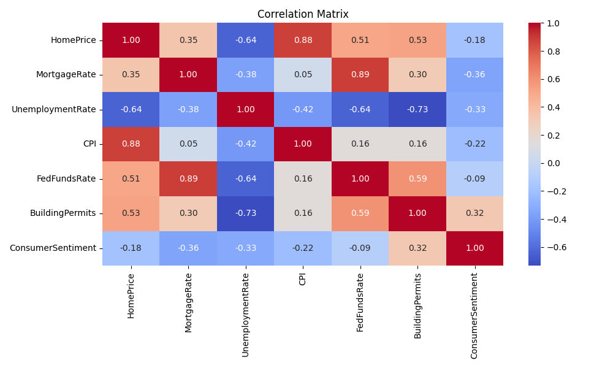

### US Home Price Analysis — 20-Year Impact Modeling
This project builds a multiple linear regression model to understand and predict U.S. home price trends over the past 20 years using publicly available economic indicators. The target variable is the S&P Case-Shiller U.S. National Home Price Index (CSUSHPISA).

--------------------------

### 📊 Data Sources (via FRED)
Mortgage Rate (30-year fixed) — MORTGAGE30US  

Unemployment Rate — UNRATE  

Consumer Price Index (CPI) — CPIAUCSL  

Federal Funds Rate — FEDFUNDS  

Building Permits — PERMIT  

Consumer Sentiment — UMCSENT  

-----------------------------

### 🔍 Model Summary
Model: Multiple Linear Regression  

R² Score: 0.9805     

RMSE: 9.44   

-------------------------

### 📈 Feature Coefficients & Impact

| Feature             | Coefficient | Interpretation |
|---------------------|-------------|----------------|
| Mortgage Rate       | 5.90        | Strongest positive impact. Indicates rising mortgage rates are historically associated with rising home prices — possibly due to inflation cycles or speculative buying before rate hikes. |
| Federal Funds Rate  | 2.54        | Positive effect suggests a complex dynamic — often correlates with broader economic strength rather than a direct cause of price increases. |
| CPI (Inflation)     | 1.40        | Positive correlation. As the general price level increases, so do housing costs — likely due to increased construction and labor costs. |
| Unemployment Rate   | 0.72        | Mild positive effect, though unexpected. Likely due to delayed or indirect economic effects; possibly an artifact of multicollinearity. |
| Building Permits    | 0.05        | Minimal impact. Suggests that although permits signal activity, they may not directly affect national price levels within this time frame. |
| Consumer Sentiment  | -0.21       | Only negative coefficient. Implies that poor consumer sentiment correlates slightly with a cooling housing market. |

📊 Visual Results
✅ Actual vs Predicted Home Prices
This scatterplot demonstrates the model's strong performance, with predictions closely hugging the ideal diagonal line.

🔥 Correlation Matrix
Illustrates how features relate to each other. Notice the strong correlation between CPI and Home Prices, and a negative correlation with Unemployment.

💾 Model Output
The trained model is saved as model.pkl using joblib, ready for inference.

Which is loaded into a Streamlit frontend for interactive home price prediction.
